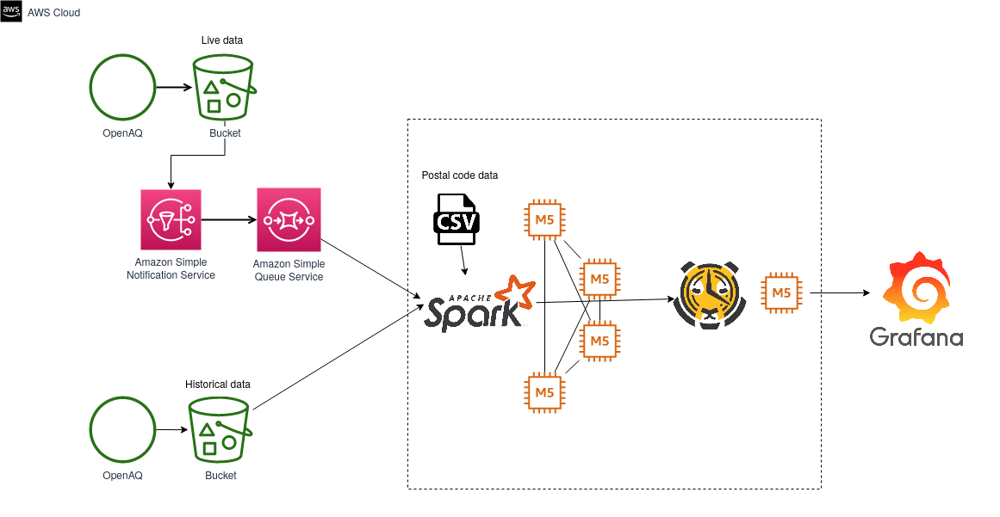
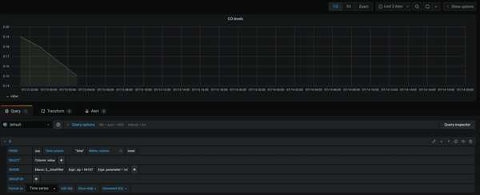

# DeltAQ : A scalable data warehouse for spatio-temporal analysis of air quality data

### Table of Contents  
1. [Introduction](#introduction)
2. [Directory Structure](#directory-structure)
3. [Data Sources](#data-sources)
4. [Tech Stack](#tech-stack)
5. [Grafana demo](#grafana-demo)
6. [Usage Instructions](#usage-instructions)

### Introduction

Air quality is an important metric that influences health indicators such as life expectancy as well as economic indicators such as real-estate prices. Different factors play a role in determining the amount of pollutants in the air, like weather, economic activity, etc. This makes the data amenable to analysis both on the spatial as well as a temporal scale. From the perspective of use-case scenarios, this project has two main sets of stakeholders. The first group are the policy makers - like city planners - and DeltAQ helps them perform long-term planning, take informed anti-pollution measures, generate alarms, etc. The second targeted group are the environmental orgs and ngos that need to create reports and comparative studies. 

From the point of view of data, what makes this a challenging problem is that the raw data does not exist in a queryable form. It has a nested and a convoluted schema, and columns that are not required for an OLAP warehouse. In addition, the geolocation data is not intuitive from a user perspective (for example, indexed by zip codes). Towards addressing these issues, I have built an ETL pipeline that ingests historical and live air quality data, indexes the data according to zip-code, and loads the data into a TimescaleDB that can be queried from using Grafana 


### Directory Structure 

```
.
├── Demo_video_1.gif
├── LICENSE
├── Pipeline.png
├── README.md
└── src
    ├── Database_setup
    │   ├── Postgres_tables
    │   │   └── Queries.sql
    │   └── Timescale_tables
    │       └── Queries.sql
    ├── Data_examples
    │   ├── aqdata.ndjson
    │   └── uszips.csv
    ├── Geospatial_integration_Spark
    │   ├── aux_funcs.py
    │   ├── configs.py
    │   └── main.py
    ├── Grafana_queries
    │   └── Queries.sql
    ├── Live_DataIngestion_SQS
    │   ├── aux_funcs.py
    │   ├── configs.py
    │   └── main.py
    └── Old_DataIngestion_Spark
        ├── aux_funcs.py
        ├── configs.py
        └── main.py
```

### Data sources

Representative data files used for this project have been uploaded to the "Data" sub-repo. 

For complete data:
* OpenAQ data: https://openaq-fetches.s3.amazonaws.com/index.html
* Zip-code data: https://simplemaps.com/data/us-zips


### Tech Stack


### Demo: Impact of Covid-lockdowns on Pollution



My product can be used to visualize how the covid-related lockdowns impacted air pollution. The straightforward and expected result is that there is indeed a reduction in pollution levels, but the trends can tell us some interesting stories. I first look at the zip-code 94107 which is San Francisco. California was one of the earliest to lockdown, and we see an almost homogeneous drop around March 15th. On the other hand, zipcode 85006, which is in Phoenix, did not lockdown until the first week of April. Going back to California, the trends in Los Angeles also show a decline around March 15th, but we continue seeing sharp spikes around 8AM during weekdays. If I had more time, I would explore these trends in the context of social behavior during these unprecedent times. 

### Usage Instructions 

#### Required installations

* Spark v2.4.5: AWS EC2 four m5 nodes (1 master and 3 workers) 
* AWS SQS
* Postgres 10.0
* TimescaleDB 10.0
* Grafana 


#### Config options 

| Configuration                               | Value     |
|---------------------------------------------|-----------|
| spark.sql.execution.arrow.enabled           | true      |
| spark.sql.inMemoryColumnarStorage.batchSize | 200000    |
| spark.sql.files.maxPartitionBytes           | 536870912 |
| spark.driver.memory                         | 10g       |
| effective_io_concurrency                    | 200       |
| max_worker_processes                        | 13        |

