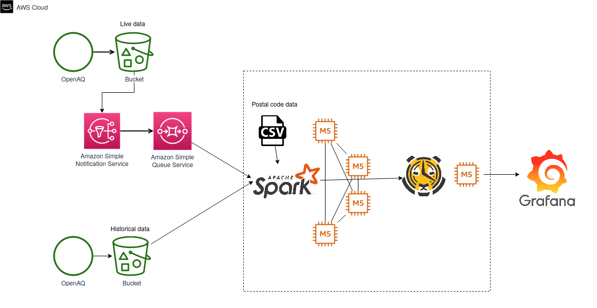
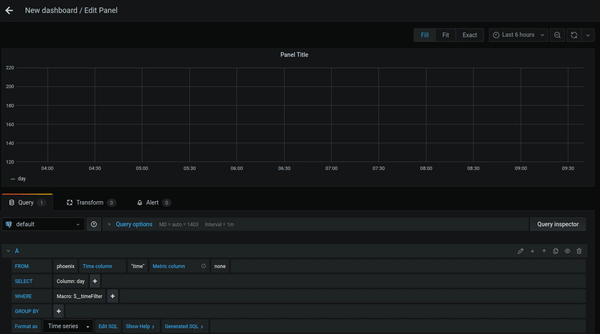

# DeltAQ : A scalable data warehouse for spatio-temporal analysis of air quality data

### Table of Contents  
1. [Background](https://github.com/ArunBaskaran/DeltAQ/tree/develop/aws-implementation#background)
2. [Data Sources](https://github.com/ArunBaskaran/DeltAQ/tree/develop/aws-implementation#data-sources)
3. [Tech Stack](https://github.com/ArunBaskaran/DeltAQ/tree/develop/aws-implementation#tech-stack)
4. [Front-end demo](https://github.com/ArunBaskaran/DeltAQ/tree/develop/aws-implementation#front-end-demo)
4. [Usage Instructions](https://github.com/ArunBaskaran/DeltAQ/tree/develop/aws-implementation#usage-instructions)

### Background

### Data sources

Representative data files used for this project have been uploaded to the "Data" sub-repo. 

For full data:
OpenAQ data: https://openaq-fetches.s3.amazonaws.com/index.html
Zip-code data: https://simplemaps.com/data/us-zips

### Tech Stack

### Front-end demo

### Usage instructions
